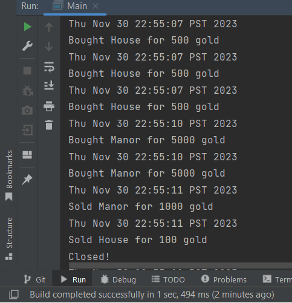

# Clicker Empire

## A Clicker Game

I am planning to create a clicker game similar to Cookie Clicker with my own twist. The game will be about
empire building where you start off with nothing but a plot of empty land. Like any clicker game, every click you will 
gain something, in this case, every click will give you citizens. Every citizen generate tax revenue which you can use 
to upgrade your dominion more to gain even more citizens passively. The game will have you progress from a small tribe
to a massive empire.  

**Target Audience:**\
This game will be for people who love clicker and empire building games.

**Why am I interested in this project:**\
This project is of great interest to me because I am very passionate about game development and I have always wanted to 
create a game like this. It is the perfect opportunity for me to use the knowledge I gained from 210 to create a game I 
am passionate about.

**User Stories:**
- As a user, I want to be able to add population to my dominion by clicking
- As a user, My citizens should be generating tax revenue
- As a user, I want to be able to view my population, tax revenue and purchased buildings
- As a user, I should be able to buy and sell buildings infinite amount of times as long as I have sufficient funds
- As a user, I want to be able to save all my in game progress into a save file.
- As a user, I want to be able to load save files.

**Instructions for Grader:**
- The click me button will add one population whenever pressed
- The buy house / manor / castle buttons can be pressed to purchase said building if the player has enough treasury
- The sell house / manor / castle buttons can be pressed to sell said building
- The viewport is on the top left which can view all the buildings owned by the player
- On the bottom right there are the options buttons where you can save load and exit the application

- You can generate the first and second required action related to the user story "adding multiple Xs to a Y" by pressing the 
buy house / manor / castle buttons
- You can remove multiple Xs to a Y by pressing sell house / manor / castle buttons
- You can locate my visual component by viewing the viewport on the top right or the stats panel on the top left
- You can save the state of my application by pressing save button
- You can reload the state of my application by pressing load button

**Example of Event Log**

